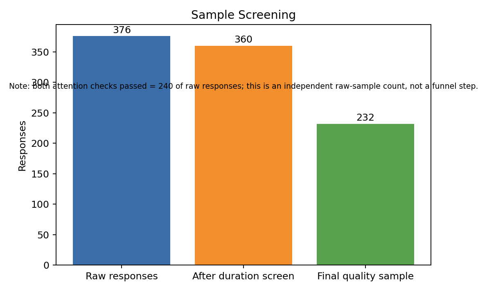
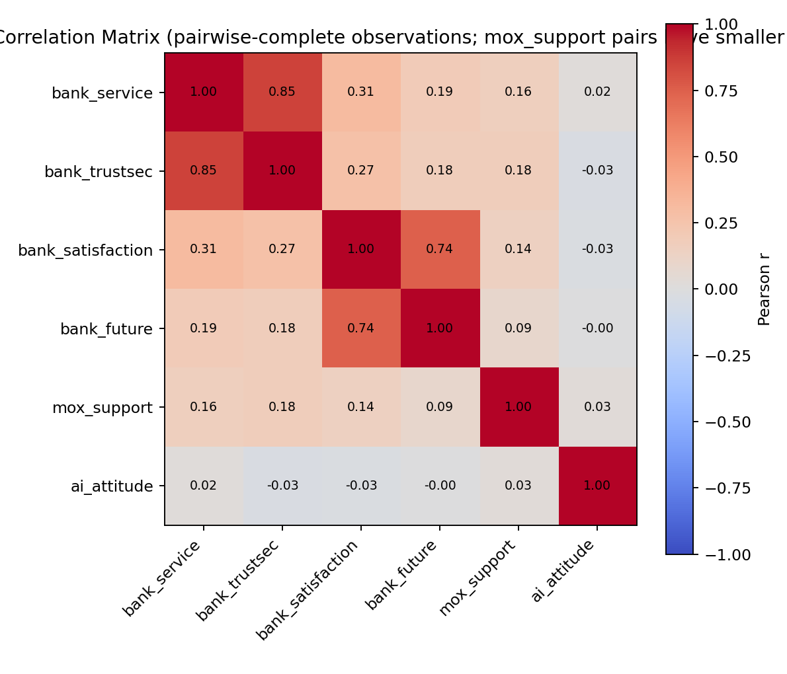
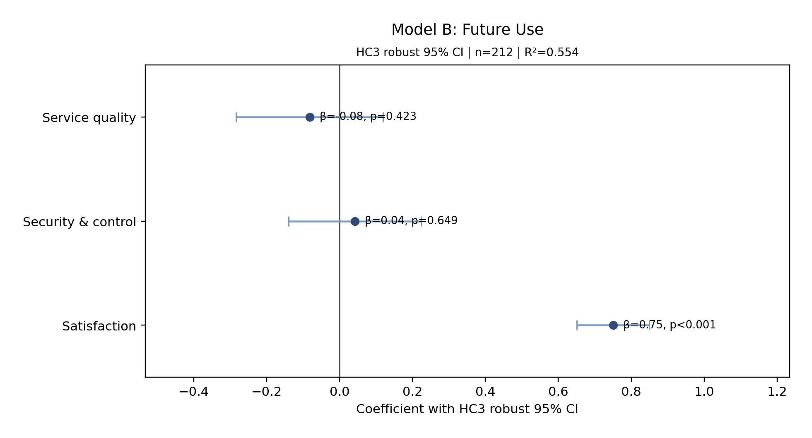

# Mox Chatbot User Research

A PolyU × HKMA IPMN Academic Project

This is a student academic and industry project completed under the HKMA Industry Project Masters Network Scheme through The Hong Kong Polytechnic University. The analysis and recommendations represent the student contributors' work and do not constitute official statements or endorsements by HKMA, PolyU, or Mox Bank.

This release-ready candidate contains a privacy-preserving analysis package for a team academic project about digital banking chatbot service quality. The project examines user perceptions and service-design considerations relating to digital banking chatbots, using Mox Bank as the project context. It does not include raw questionnaire exports, respondent-level records, respondent metadata, open-ended answers, original reports, or legacy figures.

## Programme Context

This project was completed through the Hong Kong Monetary Authority's Industry Project Masters Network (HKMA IPMN) Scheme by postgraduate students from the School of Accounting and Finance at The Hong Kong Polytechnic University.

The repository documents the student contributors' research process, reproducible analysis, and project recommendations. The interpretations and conclusions presented here are those of the student contributors and should not be treated as official statements, policies, or endorsements by the Hong Kong Monetary Authority, The Hong Kong Polytechnic University, or Mox Bank.

## Project Attribution

This project was completed as a two-person academic collaboration by LIN Junyu and SHI. SHI has approved the public release of this repository and has requested surname-only attribution.

## Personal Contribution

This project was completed as a two-person academic collaboration. I co-developed the questionnaire, with primary responsibility for drafting, refining, and organising the survey content, while SHI designed the questionnaire logic and branching structure.

I independently completed the full data-processing workflow, including raw-data inspection, response-quality screening, data cleaning, variable coding, reverse coding, composite-variable construction, missing-value handling, and preparation of the analysis-ready dataset.

The analytical framework, model selection, and model specifications were developed jointly through team discussions. The written report was co-authored, with the overall workload shared broadly between both contributors. Visualisation design and production were led by SHI.

For the final presentation, I delivered the diagnostic and empirical-results section preceding the transition slide, “We found the disease. Now here is the treatment.” SHI delivered the subsequent recommendation, implementation, stakeholder, risk, and regulatory sections.

## Business Question

The project asks how perceived chatbot service quality is associated with satisfaction, future use intention, and support for a proposed digital banking chatbot feature. The wording here avoids implying that Mox Bank has formally decided to launch a specific feature.

## Environment

```bash
python -m venv .venv
```

Windows:

```bash
.venv\Scripts\activate
```

macOS/Linux:

```bash
source .venv/bin/activate
```

```bash
pip install -r requirements.txt
pytest -q
python scripts/validate_release_tree.py .
```

## Run

Demo mode uses only synthetic aggregate variables:

```bash
python src/run_analysis.py --mode demo --input data/synthetic_example.csv --output local_results/demo
```

Canonical mode requires a private local questionnaire file:

```bash
python src/run_analysis.py --mode canonical --input <private_questionnaire.xlsx> --output local_results/canonical
```

Private provenance is not written by default. To create it for internal review only:

```bash
python src/run_analysis.py --mode canonical --input <private_questionnaire.xlsx> --output local_results/canonical --provenance-output <review_only/private_provenance.json>
```

## Directory Guide

- `src`: canonical and demo analysis code.
- `notebooks`: reproducible notebook wrapper that runs demo mode by default.
- `data`: data dictionary and synthetic example only.
- `results`: canonical aggregate outputs and generated figures.
- `docs`: methodology and portfolio-facing narrative.
- `tests`: portable pytest checks for demo execution and public-repo cleanliness.
- `scripts`: pre-packaging release-tree validation.

## Privacy And Sample Screening

Canonical analysis requires a private local questionnaire file. Public outputs contain only derived variables, aggregate tables, model summaries, and synthetic demo data.



Raw responses: 376. After duration screen: 360. Final quality sample: 232. The attention-check count is reported as an independent raw-sample count, not a funnel step.

## Variables

- `bank_service`: mean of five Q10 service-performance items.
- `bank_trustsec`: mean of Q10 security perception and perceived control.
- `bank_satisfaction`: Q11 satisfaction.
- `bank_future`: Q11 future use intention.
- `mox_support`: reverse-coded Q16, larger means more support.
- `ai_attitude`: Q5 from 1 very anxious/resistant to 5 very excited.

## Main Results

All primary coefficient p values, confidence intervals, and overall model tests use HC3 robust inference. Conventional OLS standard errors, confidence intervals, and p values remain in the full JSON and CSV outputs for transparency.



The correlation heatmap uses pairwise-complete observations. Pairs involving `mox_support` have smaller effective sample sizes; see `results/tables/correlation_n_matrix.csv`.



| Model | Dependent variable | n | R² | HC3 overall test | Core HC3 result | Boundary |
|---|---:|---:|---:|---|---|---|
| A | bank_satisfaction | 212 | 0.095 | F=8.712, p<0.001 | bank_service coef=0.297, p=0.033; bank_trustsec coef=0.024, p=0.850 | Explanatory power is limited. |
| B | bank_future | 212 | 0.554 | F=84.103, p<0.001 | bank_satisfaction coef=0.750, p<0.001 | Association, not causal proof. |
| C | mox_support | 164 | 0.046 | F=2.752, p=0.044 | individual HC3 predictor p values are p=0.189, p=0.302, and p=0.957 | Conventional OLS overall p is p=0.057; interpret cautiously. |

## Mediation

Mediation A is exploratory because `bank_service` and `bank_trustsec` are highly related constructs, and construct separation still needs validation. Mediation B is reported as an adjusted exploratory model controlling for `bank_service` in both equations. Adjusted Mediation B indirect effect = 0.018; bootstrap 95% CI = [-0.157, 0.215]. Bootstrap confidence intervals are the primary inference. These models do not prove causality.

## Why Legacy Results Were Replaced

Earlier materials contained conflicting coefficients, mediation effects, and variable definitions. This package uses one canonical script, explicit variables, HC3 primary inference, validated sample screening, and a separate internal provenance file.

## License and Usage

No open-source license has been granted. All rights are reserved by the project contributors unless otherwise stated.
